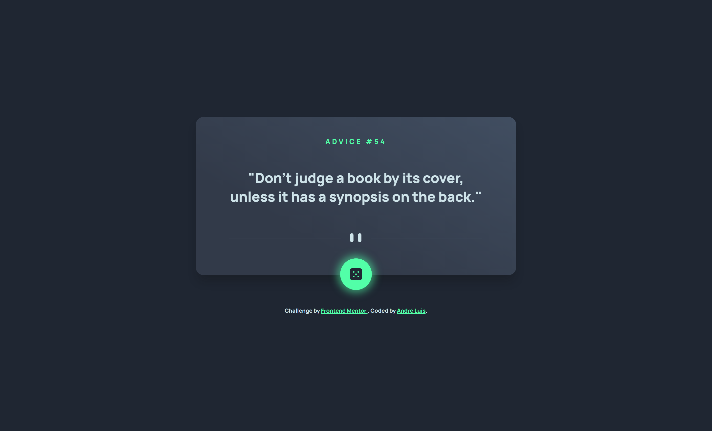

<h1 align="center"> Frontend Mentor - Advice generator app </h1>

This is a solution to the [Advice generator app on Frontend Mentor](https://www.frontendmentor.io/challenges/advice-generator-app-QdUG-13db). Frontend Mentor challenges help you improve your coding skills by building realistic projects.

 

  <a href="#-tecnologias">Tecnologias</a>&nbsp;&nbsp;&nbsp;|&nbsp;&nbsp;&nbsp;
  <a href="#-projeto">Projeto</a>&nbsp;&nbsp;&nbsp;|&nbsp;&nbsp;&nbsp;
  <a href="#-screenshots">Screenshots</a>&nbsp;&nbsp;&nbsp;|&nbsp;&nbsp;&nbsp;
  <a href="#-links">Links</a>&nbsp;&nbsp;&nbsp;

 

## 🚀 Tecnologias

Esse projeto foi desenvolvido com as seguintes tecnologias:

- HTML, CSS e JavaScript
- [Node e NPM](https://nodejs.org/)
- [Vite](https://vitejs.dev/)

## 💻 Projeto

O desafio consistiu em construir esta página, tendo como principal função gerar "conselhos". Para isso, foi utilizada a <strong>Advice Slip JSON API</strong>, uma API gratuita que possui diversos conselhos.

Para consumir a API, utilizei o método <code>fetch()</code> do JavaScript, que possibilita de maneira fácil e lógica buscar recursos de forma assíncrona pela rede. A requisição para a API é feita através da URL: <code>https://api.adviceslip.com/advice</code>, utilizando o método <code>GET</code>. Dessa forma, a resposta retorna um objeto com um "conselho" aleatório e seu ID.

 

- [Advice Slip JSON API](https://api.adviceslip.com/)

 
## 📸 Screenshots

  
  

## 🌎 Links

- Solution: [https://www.frontendmentor.io/solutions/advice-generator-app-html-css-js--AqaOYSPYG](https://www.frontendmentor.io/solutions/advice-generator-app-html-css-js--AqaOYSPYG)
- Live Site: [https://advice-generator-aandreluis.vercel.app/](https://advice-generator-aandreluis.vercel.app/)

---
